# KinoArena – Smart Cinema Booking & Management System

Modul 223 (Multiuser-Applikationen objektorientiert realisieren)
Autorin: Mara Spichiger · Klasse 24-223-E

---

## 1. Problemstellung

In kleineren und unabhängigen Kinos laufen Spielplanverwaltung und Sitzplatzreservierung
oft über starre Altsysteme oder manuelle Prozesse. Für Besucherinnen und Besucher ist
dadurch unklar, welche Plätze tatsächlich noch frei sind. Bei beliebten Vorstellungen
führen gleichzeitige Zugriffe zweier Kunden auf denselben Platz ohne saubere
Systemunterstützung zu Doppelbuchungen.

KinoArena automatisiert den Buchungsprozess vollständig und stellt sicher, dass
Parallelzugriffe fachlich korrekt und ohne Dateninkonsistenzen abgewickelt werden.

## 2. Funktionsumfang

### Kunde
- Konto erstellen, anmelden, abmelden
- Filmprogramm und Spielzeiten einsehen
- Freie Sitzplätze im virtuellen Saalplan auswählen und verbindlich buchen
- Buchung bestätigen, Zahlungsmethode wählen und bezahlen (simuliert)
- Tickets inklusive QR-Code abrufen und stornieren
- Eigenes Profil bearbeiten

### Administrator
- Filme verwalten (CRUD)
- Säle anlegen; der Saalplan wird aus Reihen und Plätzen pro Reihe erzeugt
- Vorstellungen terminieren und Sälen zuweisen
- Benutzer und Rollen verwalten
- Aktivitätsprotokoll einsehen und filtern

---

## 3. Datenmodell

```mermaid
erDiagram
    USER ||--o{ BOOKING : "bucht"
    USER ||--o{ ACTIVITY_LOG : "verursacht"
    MOVIE ||--o{ SHOWTIME : "wird gezeigt in"
    AUDITORIUM ||--o{ SHOWTIME : "beherbergt"
    AUDITORIUM ||--o{ SEAT : "enthält"
    SHOWTIME ||--o{ BOOKING : "wird gebucht als"
    SHOWTIME ||--o{ SEAT_HOLD : "wird reserviert in"
    SEAT ||--o{ BOOKING : "wird belegt durch"
    SEAT ||--o{ SEAT_HOLD : "wird reserviert als"
    USER ||--o{ SEAT_HOLD : "reserviert"

    USER {
        int id PK
        string email_address UK
        string password_digest
        string name
        boolean admin
    }
    MOVIE {
        int id PK
        string title
        text description
        int duration_minutes
        string poster_url
        int lock_version "Optimistic Locking"
    }
    AUDITORIUM {
        int id PK
        string name UK
        int total_seats
    }
    SEAT {
        int id PK
        int auditorium_id FK
        string row
        int number
    }
    SHOWTIME {
        int id PK
        int movie_id FK
        int auditorium_id FK
        datetime start_time
        decimal price
        int lock_version "Optimistic Locking"
    }
    BOOKING {
        int id PK
        int user_id FK
        int showtime_id FK
        int seat_id FK
        string qr_code_token UK
        decimal total_price
    }
    SEAT_HOLD {
        int id PK
        int user_id FK
        int showtime_id FK
        int seat_id FK
        datetime expires_at "5 Minuten"
    }
    ACTIVITY_LOG {
        int id PK
        int user_id FK "nullable"
        string action
        string target_type
        int target_id
        string description
        string ip_address
    }
```



Zentrale Regel: **`bookings` besitzt einen zusammengesetzten Unique-Index auf
`[showtime_id, seat_id]`** – ein Sitzplatz kann pro Vorstellung nur einmal existieren.

---

## 4. Concurrency und Datenintegrität

### Stufe 1 – Unique-Index gegen Doppelbuchungen

Zwei Kunden wählen gleichzeitig den letzten freien Platz A1 derselben Vorstellung.

Die Datenbank lässt nur eine der beiden Transaktionen durch. Die zweite scheitert mit
`ActiveRecord::RecordNotUnique` und wird im Controller abgefangen:

```ruby
# app/controllers/bookings_controller.rb
Booking.transaction { bookings.each(&:save!) }
rescue ActiveRecord::RecordNotUnique
  redirect_to showtime_path(@showtime),
              alert: "Dieser Sitzplatz wurde gerade von jemand anderem gebucht. …"
```

Die Validierung im Modell fängt den Normalfall ab, der Datenbank-Index den echten
Wettlauf – eine Validierung allein genügt bei parallelen Prozessen nicht.

### Stufe 2 – Optimistic Locking im Admin-Bereich

Zwei Administratoren bearbeiten gleichzeitig dieselbe Vorstellung. `movies` und
`showtimes` besitzen eine Spalte `lock_version`; das Formular sendet sie als Hidden
Field mit. Beim Speichern veralteter Daten wirft Rails `ActiveRecord::StaleObjectError`:

```ruby
# app/controllers/admin/base_controller.rb
rescue_from ActiveRecord::StaleObjectError, with: :handle_stale_object
```

Der zweite Administrator erhält HTTP 409 und den Hinweis, dass die Daten zwischenzeitlich
geändert wurden – statt fremde Änderungen stillschweigend zu überschreiben.

### Stufe 3 – Temporäre Reservierung mit Echtzeit-Anzeige

Damit Konflikte gar nicht erst entstehen, wird ein Sitzplatz bereits **beim Anklicken**
für 5 Minuten reserviert (`seat_holds`). Auch diese Tabelle trägt einen Unique-Index
auf `[showtime_id, seat_id]`.

Ablauf bei zwei gleichzeitigen Kunden:

1. Anna klickt Platz G9 → `POST /showtimes/:id/seat_holds` legt eine Reservierung an
2. Der Server sendet per Turbo Stream ein Update an **alle** Zuschauer der Vorstellung
3. Bei Ben wechselt derselbe Platz **sofort** auf goldgelb und wird deaktiviert
4. Anna bucht → die Reservierung wird in eine Buchung überführt, der Platz gilt als belegt
5. Bricht Anna ab, läuft die Reservierung nach 5 Minuten ab und der Platz wird wieder frei

Die Anzeige ist nur die Komfortschicht. Auch wer die Oberfläche umgeht, wird
serverseitig gestoppt:

```ruby
# app/controllers/bookings_controller.rb
reserved_by_others = showtime.seat_holds.active
                             .where(seat_id: seats.map(&:id))
                             .where.not(user_id: current_user.id)
```

| Sitzplatz-Zustand | Darstellung |
|---|---|
| Frei | Grau, anklickbar |
| Eigene Reservierung | Rot, mit Countdown |
| Fremde Reservierung | Goldgelb mit Schloss, deaktiviert |
| Gebucht | Dunkel mit × |

---

## 5. Architektur

| Schicht | Ort | Aufgabe |
|---|---|---|
| Modelle | `app/models/` | Fachlogik, Validierungen, Assoziationen |
| Policies | `app/policies/` | Berechtigungen (Pundit), zentral und testbar |
| Controller | `app/controllers/` | Ablaufsteuerung, Fehlerbehandlung |
| Views | `app/views/` | Darstellung, Tailwind-Komponenten |
| Stimulus | `app/javascript/controllers/` | Saalplan-Auswahl ohne Seitenreload |

Der Admin-Bereich liegt im Namespace `Admin::` mit eigener `BaseController`, die
`require_admin` erzwingt.

### Berechtigungskonzept

Alle Zugriffe laufen über Pundit-Policies. `ApplicationPolicy` verweigert
standardmässig alles (Deny by default), Unterklassen erlauben gezielt.

Rechte-Eskalation wird über `permitted_attributes` verhindert: Nur Administratoren
dürfen das Attribut `admin` überhaupt übermitteln.

```ruby
# app/policies/user_policy.rb
def permitted_attributes
  base = [ :name, :email_address, :password, :password_confirmation ]
  admin? ? base + [ :admin ] : base
end
```

---

## 6. Technologiestack

| Bereich | Technologie |
|---|---|
| Framework | Ruby on Rails 8.1 |
| Sprache | Ruby 4.0 |
| Datenbank | SQLite3 |
| Autorisierung | Pundit |
| Passwörter | bcrypt (`has_secure_password`) |
| Frontend | Tailwind CSS 4, Hotwire (Turbo + Stimulus) |
| QR-Codes | rqrcode |
| Tests | Minitest, Capybara |

> **Hinweis zum `json`-Gem:** Im Gemfile ist `json` auf `~> 2.21` festgenagelt.
> Version 3.x ist mit ActiveSupport 8.1 inkompatibel (`JSON.parse` akzeptiert keine
> positionalen Optionen mehr), wodurch jede angemeldete Sitzung mit einem
> `ArgumentError` abbricht.

---

## 7. Setup

Voraussetzungen: Ruby 4.0, Bundler, SQLite3

```bash
git clone git@github.com:maralein03/KinoArena.git
cd KinoArena

bin/setup                 # Abhängigkeiten, Datenbank, Seeds
bin/dev                   # Server auf http://localhost:3000
```

Datenbank einzeln aufsetzen:

```bash
bin/rails db:prepare
bin/rails db:seed
```

### Demo-Zugänge

| Rolle | E-Mail | Passwort |
|---|---|---|
| Administrator | `admin@kinoarena.test` | `password123` |
| Kundin A | `anna@example.com` | `annaanna` |
| Kunde B | `ben@example.com` | `benbenben` |

Die beiden Kundenkonten dienen dazu, die Doppelbuchungssperre (NFA-1) in zwei
getrennten Browser-Sitzungen vorzuführen.

---

## 8. Tests

```bash
bin/rails test              # Modell-, Controller- und Integrationstests
bin/rails test:system       # Systemtests (End-to-End)
bin/rails test:all          # alles zusammen
```

Systemtests laufen standardmässig mit dem `rack_test`-Treiber und benötigen keinen
installierten Browser. Für JavaScript-Prüfungen mit Headless Chrome:

```bash
SYSTEM_TEST_DRIVER=selenium bin/rails test:system
```

### Abgedeckte Szenarien

| Bereich | Datei |
|---|---|
| Doppelbuchung (Unique-Index) | `test/models/booking_test.rb` |
| Temporäre Reservierung | `test/models/seat_hold_test.rb`, `test/controllers/seat_holds_controller_test.rb` |
| Optimistic Locking | `test/models/showtime_test.rb`, `test/controllers/admin/movies_controller_test.rb` |
| Zugriffskontrolle | `test/controllers/users_controller_test.rb`, `test/system/admin_area_test.rb` |
| Buchungsablauf End-to-End | `test/system/booking_flow_test.rb` |
| Authentifizierung | `test/system/authentication_test.rb` |
| Fehlerbehandlung (404) | `test/integration/error_handling_test.rb` |
| Performance / N+1 (NFA-3) | `test/integration/spielplan_performance_test.rb` |

### Qualitätswerkzeuge

```bash
bin/rubocop                 # Code-Konventionen
bin/brakeman                # Sicherheitsanalyse
bin/bundler-audit check     # Bekannte Schwachstellen in Gems
```

### NFA-3: Lasttest des Spielplans

Die Anforderung „50 gleichzeitige Abfragen unter 1,5 Sekunden" wird nicht behauptet,
sondern gemessen. Bei laufendem Server:

```bash
bin/rails benchmark:showtimes
```

Der Task feuert 50 echte HTTP-Anfragen parallel ab und bricht mit Fehlercode ab,
wenn eine davon den Grenzwert reisst. Parameter lassen sich überschreiben:

```bash
REQUESTS=100 CONCURRENCY=50 LIMIT=1.5 URL=http://localhost:3000/ bin/rails benchmark:showtimes
```

Messung auf dem Entwicklungsrechner (WSL2, Puma mit 3 Threads, **Development-Modus**):

| Kennzahl | Wert |
|---|---|
| Gesamtdauer für 50 parallele Anfragen | 1,09 – 1,26 s |
| Median (p50) | 0,53 – 0,58 s |
| p95 | 0,98 – 1,14 s |
| Langsamste Anfrage | 1,01 – 1,18 s |
| Fehlerhafte Antworten | keine (50 × HTTP 200) |

Die Anforderung ist damit erfüllt. Der Wert ist konservativ, weil im
Development-Modus bei jeder Anfrage Code neu geladen wird – in Produktion
entfällt dieser Aufwand.

Damit die Ladezeit stabil bleibt, hält
`test/integration/spielplan_performance_test.rb` fest, dass die Anzahl der
Datenbankabfragen **nicht** mit der Anzahl der Filme wächst (kein N+1-Problem).

---

## 9. Abdeckung der Anforderungen

| Anforderung | Umsetzung |
|---|---|
| FA-1 Authentifizierung | `SessionsController`, `RegistrationsController` |
| FA-2 Film- & Vorstellungsübersicht | `ShowtimesController#index`, `MoviesController#show` |
| FA-3 Sitzplatzauswahl & Buchung | `ShowtimesController#show`, `BookingsController#create` |
| FA-4 Meine Buchungen | `BookingsController#index` / `#show` |
| FA-5 Filmverwaltung | `Admin::MoviesController` |
| FA-6 Spielplanverwaltung | `Admin::ShowtimesController`, `Admin::AuditoriaController` |
| FA-Opt-1 QR-Code | `BookingsHelper#qr_code_svg` |
| FA-Opt-2 Zahlungs-Checkout | `CheckoutsController`, simulierte Zahlung mit Apple Pay / Kreditkarte / TWINT |
| FA-Opt-3 Temporäre Reservierung | `SeatHold`, 5 Minuten, Echtzeit via Turbo Stream |
| FA-Opt-3 Temporäre Reservierung | `SeatHold`, `SeatHoldsController`, Turbo Streams |
| NFA-1 Keine Doppelbuchungen | Unique-Index `[showtime_id, seat_id]` |
| NFA-2 Optimistic Locking | `lock_version` auf `movies` und `showtimes` |
| NFA-3 Performance | Lasttest `bin/rails benchmark:showtimes`, N+1-Schutz im Testfall |
| NFA-4 Access Control | Pundit-Policies, `require_admin` |
| NFA-5 Fehlerbehandlung | Formulare mit erhaltenen Eingaben, 404-Seite, Flash-Meldungen |

### Nicht umgesetzt

| Anforderung | Begründung |
|---|---|
| Echte Zahlungsabwicklung | Der Checkout simuliert die Zahlung bewusst. Eine Anbindung an einen echten Anbieter erfordert Vertragsdaten und PCI-DSS-Auflagen, die im Schulkontext nicht erfüllbar sind. Gespeichert wird nur die gewählte Zahlungsart. |

---

## 10. Aktivitätsprotokoll

Jede sicherheits- und fachrelevante Aktion wird in `activity_logs` festgehalten:
Anmeldung, fehlgeschlagener Anmeldeversuch, Abmeldung, Registrierung,
Profiländerung, Kontolöschung, Buchung, Buchungskonflikt, Stornierung,
CRUD-Operationen auf Filme und Vorstellungen sowie Locking-Konflikte.

Das Protokoll ist unter `/admin/activity_logs` nach Aktion und Benutzer filterbar.
Fehler beim Schreiben eines Eintrags brechen den Fachablauf bewusst nicht ab.
