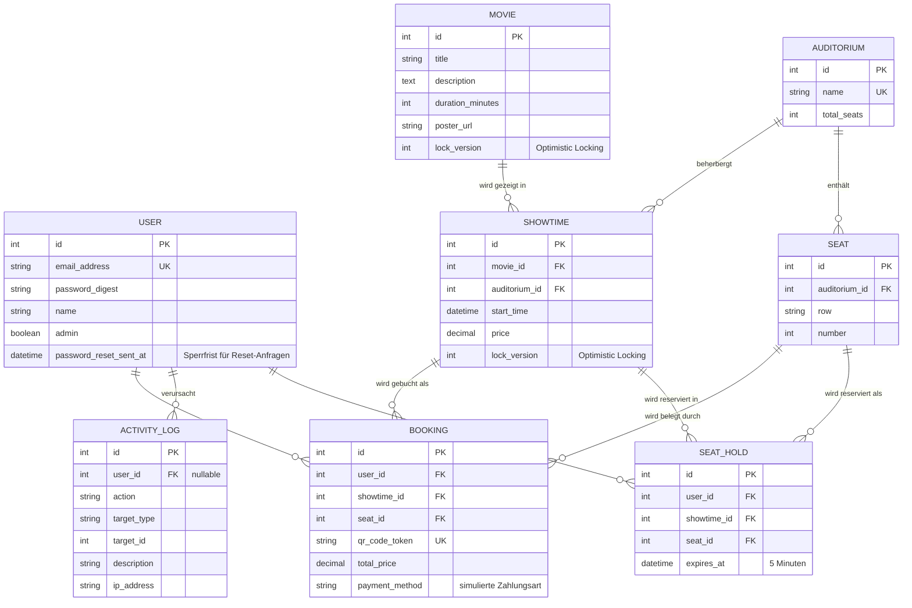

# KinoArena – Smart Cinema Booking & Management System 🎬🎟️

**Modul 223:** Multiuser-Applikationen objektorientiert realisieren
**Autorin:** Mara Spichiger
**Schulklasse:** 24-223-E
**Datum:** 18.09.2026 (überarbeitet am 24.09.2026)

---

## 📌 1. Über das Projekt

In kleineren und unabhängigen Kinos laufen Spielplanverwaltung und Sitzplatzreservierung
oft über starre Altsysteme oder manuelle Prozesse. Für Besucherinnen und Besucher ist
dadurch unklar, welche Plätze tatsächlich noch frei sind. Bei beliebten Vorstellungen
führen gleichzeitige Zugriffe zweier Kunden auf denselben Platz ohne saubere
Systemunterstützung zu Doppelbuchungen.

**KinoArena** ist eine objektorientierte Multiuser-Webapplikation auf Basis von
**Ruby on Rails 8**. Sie automatisiert den Buchungs- und Reservierungsprozess
vollständig: Kunden sehen den Saalplan in Echtzeit und buchen Sitzplätze, während
strikte Concurrency-Mechanismen sicherstellen, dass kein Platz doppelt vergeben wird.

## 🎯 2. Funktionsumfang

### Kunde
- Konto erstellen, anmelden, abmelden
- Vergessenes Passwort über einen zeitlich begrenzten Link zurücksetzen
- Filmprogramm und Spielzeiten einsehen
- Freie Sitzplätze im virtuellen Saalplan auswählen und verbindlich buchen
- Buchung bestätigen, Zahlungsmethode wählen und bezahlen (simuliert)
- Tickets inklusive QR-Code abrufen und stornieren
- Eigenes Profil bearbeiten

### Administrator
- Filme verwalten (CRUD)
- Säle anlegen; der Saalplan wird aus Reihen und Plätzen pro Reihe erzeugt
- Vorstellungen terminieren und Sälen zuweisen
- Benutzer und Rollen verwalten
- Aktivitätsprotokoll einsehen und filtern

---

## 🗄️ 3. Datenmodell



Zentrale Regel: **`bookings` besitzt einen zusammengesetzten Unique-Index auf
`[showtime_id, seat_id]`** – ein Sitzplatz kann pro Vorstellung nur einmal existieren.

---

## 🔒 4. Concurrency und Datenintegrität

### Stufe 1 – Unique-Index gegen Doppelbuchungen

Zwei Kunden wählen gleichzeitig den letzten freien Platz A1 derselben Vorstellung.

Die Datenbank lässt nur eine der beiden Transaktionen durch. Die zweite scheitert mit
`ActiveRecord::RecordNotUnique` und wird im Controller abgefangen:

```ruby
# app/controllers/bookings_controller.rb
rescue ActiveRecord::RecordNotUnique
  log_activity("booking_conflict", target: @showtime,
               description: "Doppelbuchung verhindert (DB-Constraint)")
  redirect_to showtime_path(@showtime),
              alert: "Dieser Sitzplatz wurde gerade von jemand anderem gebucht. …"
```

Die Validierung im Modell fängt den Normalfall ab, der Datenbank-Index den echten
Wettlauf – eine Validierung allein genügt bei parallelen Prozessen nicht.
`test/integration/concurrent_booking_test.rb` weist das nach: fünf echte Threads mit
eigenen Datenbankverbindungen greifen gleichzeitig auf denselben Platz zu, genau
einer bekommt ihn.

### Stufe 2 – Optimistic Locking im Admin-Bereich

Zwei Administratoren bearbeiten gleichzeitig dieselbe Vorstellung. `movies` und
`showtimes` besitzen eine Spalte `lock_version`; das Formular sendet sie als Hidden
Field mit. Beim Speichern veralteter Daten wirft Rails `ActiveRecord::StaleObjectError`:

```ruby
# app/controllers/admin/base_controller.rb
rescue_from ActiveRecord::StaleObjectError, with: :handle_stale_object
```

Der zweite Administrator erhält HTTP 409 und den Hinweis, dass die Daten zwischenzeitlich
geändert wurden – statt fremde Änderungen stillschweigend zu überschreiben.

### Stufe 3 – Temporäre Reservierung mit Echtzeit-Anzeige

Damit Konflikte gar nicht erst entstehen, wird ein Sitzplatz bereits **beim Anklicken**
für 5 Minuten reserviert (`seat_holds`). Auch diese Tabelle trägt einen Unique-Index
auf `[showtime_id, seat_id]`.

Ablauf bei zwei gleichzeitigen Kunden:

1. Anna klickt Platz G9 → `POST /showtimes/:id/seat_holds` legt eine Reservierung an
2. Der Server sendet per Turbo Stream ein Update an **alle** Zuschauer der Vorstellung
3. Bei Ben wechselt derselbe Platz **sofort** auf goldgelb und wird deaktiviert
4. Anna bucht → die Reservierung wird in eine Buchung überführt, der Platz gilt als belegt
5. Bricht Anna ab, läuft die Reservierung nach 5 Minuten ab und der Platz wird wieder frei

Die Anzeige ist nur die Komfortschicht. Auch wer die Oberfläche umgeht, wird
serverseitig gestoppt:

```ruby
# app/controllers/bookings_controller.rb
reserved_by_others = showtime.seat_holds.active
                             .where(seat_id: seats.map(&:id))
                             .where.not(user_id: current_user.id)
```

| Sitzplatz-Zustand | Darstellung |
|---|---|
| Frei | Grau, anklickbar |
| Eigene Reservierung | Rot, mit Countdown |
| Fremde Reservierung | Goldgelb mit Schloss, deaktiviert |
| Gebucht | Dunkel mit × |

### Stufe 4 – Pessimistic Locking beim Buchen

Zwischen der Prüfung „ist dieser Platz noch frei?“ und dem eigentlichen `INSERT`
liegt ein Zeitfenster. Damit dort keine fremde Buchung dazwischenrät, wird die
Vorstellung für die Dauer des Vorgangs gesperrt:

```ruby
# app/controllers/bookings_controller.rb
@showtime.with_lock do
  bookings = build_bookings(@showtime, seat_ids)   # Prüfung der Sitzplätze
  bookings.each(&:save!)                           # Schreiben
  @showtime.seat_holds.where(seat_id: …).delete_all
end
```

`with_lock` öffnet eine Transaktion und lädt die Vorstellung mit `SELECT … FOR UPDATE`
neu. Prüfung und Schreiben bilden dadurch eine ununterbrechbare Einheit: ein zweiter
Prozess wartet, statt auf veralteten Daten zu entscheiden.

> **Einordnung:** SQLite kennt kein `FOR UPDATE` und serialisiert Schreibzugriffe
> ohnehin auf Datenbankebene; die Lock-Klausel wird dort verworfen. Der Schutz ist
> deshalb in dieser Umgebung nicht messbar, der Code bleibt aber portabel – auf
> PostgreSQL oder MySQL greift die Sperre unverändert. Die tatsächliche Garantie
> gegen Doppelbuchungen liefert in jedem Fall der Unique-Index aus Stufe 1.

### Zusammenspiel der vier Stufen

| Stufe | Mechanismus | Greift bei |
|---|---|---|
| 1 | Unique-Index + `rescue RecordNotUnique` | Echter Wettlauf um denselben Platz |
| 2 | Optimistic Locking (`lock_version`) | Zwei Admins bearbeiten denselben Datensatz |
| 3 | Temporäre Reservierung + Turbo Stream | Konflikt entsteht gar nicht erst |
| 4 | Pessimistic Locking (`with_lock`) | Prüfen und Schreiben bleiben atomar |

---

## 🏗️ 5. Architektur

| Schicht | Ort | Aufgabe |
|---|---|---|
| Modelle | `app/models/` | Fachlogik, Validierungen, Assoziationen |
| Policies | `app/policies/` | Berechtigungen (Pundit), zentral und testbar |
| Controller | `app/controllers/` | Ablaufsteuerung, Fehlerbehandlung |
| Views | `app/views/` | Darstellung, Tailwind-Komponenten |
| Stimulus | `app/javascript/controllers/` | Saalplan-Auswahl ohne Seitenreload |

Der Admin-Bereich liegt im Namespace `Admin::` mit eigener `BaseController`, die
`require_admin` erzwingt.

### Berechtigungskonzept

Alle Zugriffe laufen über Pundit-Policies. `ApplicationPolicy` verweigert
standardmässig alles (Deny by default), Unterklassen erlauben gezielt.

Rechte-Eskalation wird über `permitted_attributes` verhindert: Nur Administratoren
dürfen das Attribut `admin` überhaupt übermitteln.

```ruby
# app/policies/user_policy.rb
def permitted_attributes
  base = [ :name, :email_address, :password, :password_confirmation ]
  admin? ? base + [ :admin ] : base
end
```

Zusätzlich verhindert eine Validierung im Modell, dass sich der **letzte**
Administrator selbst zum Kunden herabstuft – sonst wäre der Admin-Bereich für
niemanden mehr erreichbar.

### Kontosicherheit

**Passwort vergessen.** Über `/password_resets/new` fordert eine Kundin einen Link an.
Der Token wird mit `generates_token_for` aus dem Passwort-Hash abgeleitet:

```ruby
# app/models/user.rb
generates_token_for :password_reset, expires_in: PASSWORD_RESET_VALIDITY do
  password_salt&.last(10)
end
```

Daraus folgen drei Eigenschaften, ohne dass dafür eine Tokentabelle nötig wäre:

* Der Link verfällt nach 15 Minuten.
* Er wird mit der Passwortänderung automatisch ungültig und ist damit einmalig.
* Er lässt sich nicht fälschen, da er mit `secret_key_base` signiert ist.

Die Antwort des Formulars lautet immer gleich – unabhängig davon, ob die Adresse
existiert. Sonst liesse sich darüber herausfinden, wer registriert ist
(User Enumeration). Eine Sperrfrist von 2 Minuten verhindert, dass jemand per
Dauerfeuer Postfächer flutet.

**Brute-Force-Schutz.** Nach fünf Fehlversuchen wird die Kombination aus IP-Adresse
und E-Mail-Adresse für 15 Minuten gesperrt; die Anmeldung antwortet dann mit
HTTP 429 und der Versuch landet im Aktivitätsprotokoll. Eine erfolgreiche Anmeldung
setzt den Zähler zurück. Gezählt wird in einem prozesslokalen Cache, damit dafür
keine Benutzerdaten geschrieben werden müssen.

---

## 🛠️ 6. Technologiestack & Systemumgebung

| Bereich | Technologie |
|---|---|
| Framework | Ruby on Rails 8.1+ |
| Sprache | Ruby 4.0+ |
| Datenbank | SQLite3 |
| Frontend | Tailwind CSS 4, ERB, Hotwire (Turbo + Stimulus) |
| Autorisierung | Pundit |
| Passwörter | bcrypt (`has_secure_password`) |
| QR-Codes | rqrcode |
| Tests | Minitest, Capybara |
| Entwicklungsumgebung | Windows 11 / WSL2 (Ubuntu) / VS Code |

**Concurrency Protection**

* Unique Database Index auf `[showtime_id, seat_id]` gegen Doppelbuchungen
* Active Record Optimistic Locking (`lock_version`) für Admin-CRUD
* Temporäre Sitzplatzreservierung mit Echtzeit-Anzeige über Turbo Streams
* Pessimistic Locking (`with_lock`) um Prüfung und Buchung herum

**Kontosicherheit**

* Passwort-Reset per signiertem Token (`generates_token_for`), 15 Minuten gültig
* Drosselung der Anmeldung nach fünf Fehlversuchen
* Schutz des letzten Administratorkontos vor Rollenentzug und Löschung

> **Hinweis zum `json`-Gem:** Im Gemfile ist `json` auf `~> 2.21` festgenagelt.
> Version 3.x ist mit ActiveSupport 8.1 inkompatibel (`JSON.parse` akzeptiert keine
> positionalen Optionen mehr), wodurch jede angemeldete Sitzung mit einem
> `ArgumentError` abbricht.

---

## 🚀 7. Installation & lokaler Start

**Voraussetzungen:** Ruby 4.0+, Rails 8.1+, Bundler und SQLite3 in der WSL2-Umgebung.

**1. Repository klonen und Projektordner öffnen**

```bash
git clone git@github.com:maralein03/KinoArena.git
cd KinoArena
```

**2. Gems installieren**

```bash
bundle install
```

**3. Datenbank vorbereiten und Migrationen ausführen**

```bash
bin/rails db:prepare
```

**4. Testdaten laden**

```bash
bin/rails db:seed
```

**5. Entwicklungsserver starten**

```bash
bin/dev
```

**6. Applikation öffnen:** <http://localhost:3000>

> Alternativ erledigt `bin/setup` die Schritte 2 bis 5 in einem Durchgang und startet
> anschliessend den Entwicklungsserver. Mit `bin/setup --skip-server` bleibt der Server
> aus. Testdaten werden dabei nur beim erstmaligen Anlegen der Datenbank geladen –
> danach jederzeit manuell mit `bin/rails db:seed`.

> **E-Mails in der Entwicklung:** Es ist kein SMTP-Server konfiguriert. Mails werden
> stattdessen als Datei unter `tmp/mails/` abgelegt. Den Link aus der
> Passwort-Reset-Mail findest du dort im Klartext:
>
> ```bash
> cat tmp/mails/*
> ```

---

## 🔑 8. Demo-Zugangsdaten (nach `db:seed`)

| Rolle | E-Mail | Passwort |
|---|---|---|
| Administrator | `admin@kinoarena.test` | `password123` |
| Kundin A | `anna@example.com` | `annaanna` |
| Kunde B | `ben@example.com` | `benbenben` |

Die beiden Kundenkonten dienen dazu, die Doppelbuchungssperre (NFA-1) in zwei
getrennten Browser-Sitzungen vorzuführen – zum Beispiel in einem normalen und
einem privaten Fenster, damit sich die Sitzungen nicht das Cookie teilen.

Zusätzlich legt `db:seed` ein Sammelkonto **Abendkasse**
(`abendkasse@kinoarena.test`) an. Ihm gehören die vorbelegten Sitzplätze, damit der
Saalplan realistisch gefüllt ist, die Ticketlisten der Demo-Kunden aber leer bleiben.
Das Konto hat ein zufälliges Passwort und ist für die Anmeldung nicht vorgesehen.

---

## 🧪 9. Tests

```bash
bin/rails test              # Modell-, Controller- und Integrationstests
bin/rails test:system       # Systemtests (End-to-End)
bin/rails test:all          # alles zusammen
```

Systemtests laufen standardmässig mit dem `rack_test`-Treiber und benötigen keinen
installierten Browser. Für JavaScript-Prüfungen mit Headless Chrome:

```bash
SYSTEM_TEST_DRIVER=selenium bin/rails test:system
```

### Abgedeckte Szenarien

| Bereich | Datei |
|---|---|
| Doppelbuchung (Unique-Index) | `test/models/booking_test.rb` |
| Doppelbuchung unter echter Nebenläufigkeit | `test/integration/concurrent_booking_test.rb` |
| Temporäre Reservierung | `test/models/seat_hold_test.rb`, `test/controllers/seat_holds_controller_test.rb` |
| Optimistic Locking | `test/models/showtime_test.rb`, `test/controllers/admin/movies_controller_test.rb` |
| Zugriffskontrolle | `test/controllers/users_controller_test.rb`, `test/system/admin_area_test.rb` |
| Buchungsablauf End-to-End | `test/system/booking_flow_test.rb` |
| Authentifizierung | `test/system/authentication_test.rb` |
| Passwort-Reset | `test/controllers/password_resets_controller_test.rb`, `test/mailers/user_mailer_test.rb` |
| Brute-Force-Drosselung | `test/controllers/sessions_controller_test.rb` |
| Fehlerbehandlung (404) | `test/integration/error_handling_test.rb` |
| Performance / N+1 (NFA-3) | `test/integration/spielplan_performance_test.rb` |

### Qualitätswerkzeuge

```bash
bin/rubocop                 # Code-Konventionen
bin/brakeman                # Sicherheitsanalyse
bin/bundler-audit check     # Bekannte Schwachstellen in Gems
```

### NFA-3: Lasttest des Spielplans

Die Anforderung „50 gleichzeitige Abfragen unter 1,5 Sekunden" wird nicht behauptet,
sondern gemessen. Bei laufendem Server:

```bash
bin/rails benchmark:showtimes
```

Der Task wärmt den Server auf, feuert dann 50 echte HTTP-Anfragen parallel ab und
bricht mit Fehlercode ab, wenn eine davon den Grenzwert reisst. Parameter lassen
sich überschreiben:

```bash
REQUESTS=100 CONCURRENCY=50 LIMIT=1.5 URL=http://localhost:3000/ bin/rails benchmark:showtimes
```

**Messumgebung:** WSL2 (Ubuntu) auf Windows 11, Puma mit 3 Threads, SQLite3,
50 gleichzeitige Anfragen auf `/`.

| Kennzahl | Produktionsmodus | Development-Modus |
|---|---|---|
| Durchsatz | 137 – 293 Anfragen/s | 21 – 33 Anfragen/s |
| Median (p50) | 0,07 – 0,15 s | 0,69 – 1,25 s |
| p95 | 0,13 – 0,28 s | 1,42 – 2,30 s |
| Langsamste Anfrage | **0,13 – 0,29 s** | 1,49 – 2,32 s |
| Fehlerhafte Antworten | keine (50 × HTTP 200) | keine (50 × HTTP 200) |
| NFA-3 erfüllt | **ja**, Faktor 5 – 10 Reserve | nicht zuverlässig |

**Bewertung:** Im Produktionsmodus ist die Anforderung deutlich erfüllt. Im
Development-Modus wird der Grenzwert gerissen, weil Rails dort bei jeder Anfrage
den Anwendungscode auf Änderungen prüft und neu lädt. Da NFA-3 das ausgelieferte
System beschreibt, ist der Produktionswert massgeblich – der Development-Wert ist
hier nur zur Einordnung angegeben.

So lässt sich die Messung im Produktionsmodus nachvollziehen:

```bash
SECRET_KEY_BASE_DUMMY=1 bin/rails assets:precompile
export SECRET_KEY_BASE=$(bin/rails secret)
RAILS_ENV=production bin/rails db:prepare db:seed
RAILS_ENV=production bin/rails server -p 3001

# in einem zweiten Terminal
URL=http://localhost:3001/ bin/rails benchmark:showtimes
```

> Nach der Messung `rm -rf public/assets` ausführen, sonst liefert der
> Entwicklungsserver weiterhin die vorkompilierten statt der aktuellen Assets.

Damit die Ladezeit stabil bleibt, hält
`test/integration/spielplan_performance_test.rb` fest, dass die Anzahl der
Datenbankabfragen **nicht** mit der Anzahl der Filme wächst (kein N+1-Problem).

---

## ✅ 10. Abdeckung der Anforderungen

| Anforderung | Umsetzung |
|---|---|
| FA-1 Authentifizierung | `SessionsController`, `RegistrationsController` |
| FA-1b Passwort vergessen | `PasswordResetsController`, `UserMailer`, `generates_token_for` |
| FA-2 Film- & Vorstellungsübersicht | `ShowtimesController#index`, `MoviesController#show` |
| FA-3 Sitzplatzauswahl & Buchung | `ShowtimesController#show`, `BookingsController#create` |
| FA-4 Meine Buchungen & QR-Code | `BookingsController#index` / `#show`, `BookingsHelper#qr_code_svg` |
| FA-5 Filmverwaltung | `Admin::MoviesController` |
| FA-6 Spielplanverwaltung | `Admin::ShowtimesController`, `Admin::AuditoriaController` |
| FA-7 Profilverwaltung | `UsersController#edit` / `#update` |
| FA-8 Benutzerverwaltung | `UsersController#index`, `UserPolicy#change_role?` |
| FA-9 Aktivitätsprotokoll | `ActivityLog`, `Admin::ActivityLogsController` |
| FA-Opt-1 Temporäre Reservierung | `SeatHold`, `SeatHoldsController`, 5 Minuten, Turbo Streams |
| FA-Opt-2 Zahlungs-Checkout | `CheckoutsController`, simuliert mit Apple Pay / Kreditkarte / TWINT |
| FA-Opt-3 Stornierung | `BookingsController#destroy`, nur bei künftiger Vorstellung |
| NFA-1 Keine Doppelbuchungen | Unique-Index `[showtime_id, seat_id]`, `with_lock` beim Buchen |
| NFA-2 Optimistic Locking | `lock_version` auf `movies` und `showtimes` |
| NFA-3 Performance | Lasttest `bin/rails benchmark:showtimes`, N+1-Schutz im Testfall |
| NFA-4 Access Control | Pundit-Policies, `require_admin` |
| NFA-5 Fehlerbehandlung | Formulare mit erhaltenen Eingaben, 404-Seite, Flash-Meldungen |
| NFA-6 Automatisierte Tests | 27 Testdateien, 128 Testfälle (Model, Controller, Integration, System) |
| NFA-7 Kontosicherheit | bcrypt, Login-Drosselung, signierte Reset-Token, Schutz des letzten Admins |

### Nicht umgesetzt

| Anforderung | Begründung |
|---|---|
| Echte Zahlungsabwicklung | Der Checkout simuliert die Zahlung bewusst. Eine Anbindung an einen echten Anbieter erfordert Vertragsdaten und PCI-DSS-Auflagen, die im Schulkontext nicht erfüllbar sind. Gespeichert wird nur die gewählte Zahlungsart. |

---

## 📋 11. Aktivitätsprotokoll

Jede sicherheits- und fachrelevante Aktion wird in `activity_logs` festgehalten:
Anmeldung, fehlgeschlagener Anmeldeversuch, gesperrte Anmeldung nach zu vielen
Fehlversuchen, Abmeldung, Registrierung, angeforderter und abgeschlossener
Passwort-Reset, Aufruf eines ungültigen Reset-Links, Profiländerung, Kontolöschung,
Buchung, Buchungskonflikt, Stornierung, CRUD-Operationen auf Filme, Säle und
Vorstellungen sowie Locking-Konflikte.

Das Protokoll ist unter `/admin/activity_logs` nach Aktion und Benutzer filterbar.
Fehler beim Schreiben eines Eintrags brechen den Fachablauf bewusst nicht ab.

---

## 🌿 12. Git-Branch-Strategie

Die Entwicklung erfolgt über Feature-Branches, damit jeder Arbeitsschritt
nachvollziehbar bleibt. Zusammengeführt wird über Pull Requests auf `main`.

| Branch | Inhalt |
|---|---|
| `main` | Stabiler Hauptzweig, enthält nur geprüfte Stände |
| `feat-Datenbank-und-Modelle-erstellen` | Datenmodell, Migrationen, Validierungen |
| `feat-Benutzerauthentifizierung-implementieren` | Registrierung, An- und Abmeldung |
| `feat-Benutzerprofil-implementieren` | Profilansicht und -bearbeitung |
| `feat-Benutzerverwaltung-implementieren` | Benutzerübersicht für Administratoren |
| `feat-Benutzerrollen-und-Berechtigungen-implementieren` | Rollenkonzept und Pundit-Policies |
| `feat-Kernfunktion-implementieren` | Saalplan, Buchung, Checkout, Reservierung |
| `feat-Aktivitätsprotokoll-implementieren` | Protokollierung aller relevanten Aktionen |

Typischer Ablauf:

```bash
git checkout main
git pull
git checkout -b feat-neues-thema

# arbeiten, committen
git push -u origin feat-neues-thema
# Pull Request auf GitHub eröffnen und nach main mergen
```
